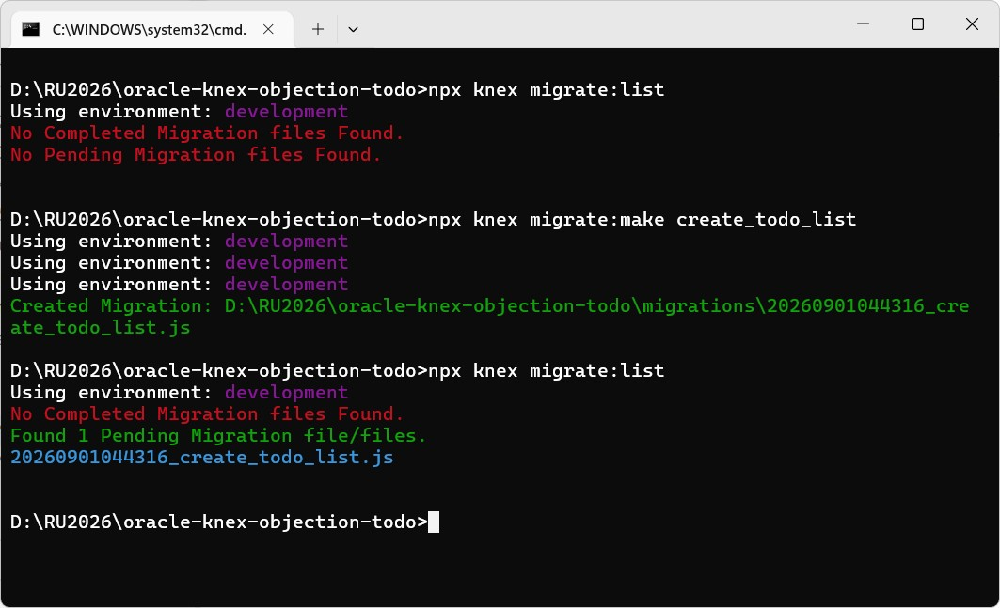
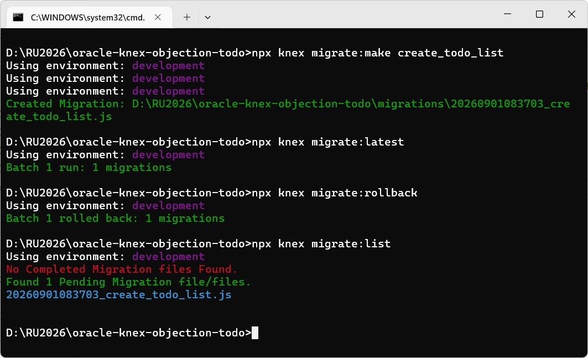
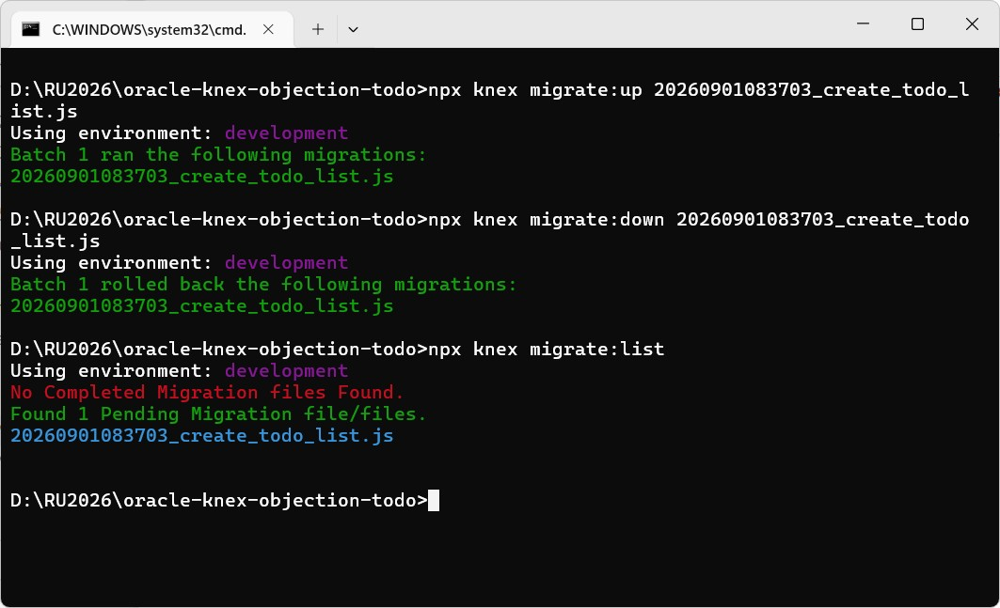
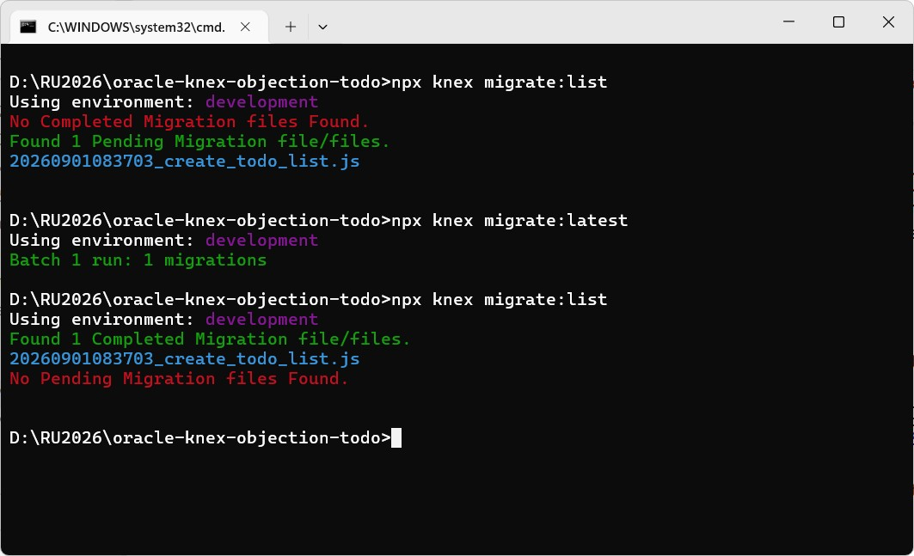

### Tutorial: Building an Oracle Todo App with Objection.js + Knex.js

"These are my Confessions, and if in them I say nothing, it’s because I have nothing to say."
"São as minhas Confissões, e, se nelas nada digo, é que nada tenho que dizer."

"A tedium that includes the expectation of nothing but more tedium; a regret, right now, for the regret I’ll have tomorrow for having felt regret today – huge confusions with no point and no truth, huge confusions…"
"Um tédio que inclui a antecipação só de mais tédio; a pena, já, de amanhã ter pena de ter tido pena hoje — grandes emaranhamentos sem utilidade nem verdade, grandes emaranhamentos..."


#### Prologue 
Honestly, I won't recommend Oracle to anyone, as for ORM, I won't recommend it either. The more I work with ORMs, the more I appreciate the succinctness of [SQL](https://en.wikipedia.org/wiki/SQL) and immense capability. 


#### [Code-First vs Database-First](https://strapi.io/blog/code-first-vs-database-first)
> **Code-First** and **Database-First** determines your application's single source of truth and dictates how data structures evolve.

> Code-first starts with your domain models, not the database. You define your data structures as classes, and the framework generates the database schema from them. This keeps business logic at the center and ensures your data model evolves directly from application code.

> Database-first begins with an existing database schema and generates entity classes from it. This approach emphasizes database design and optimization, which is ideal for data-heavy applications or projects built on legacy systems.

Legacy applications are built on tables of RDBMS. They evince high efficiency but tend to be [Close coupling](https://en.wikipedia.org/wiki/Close_coupling) with specific backend. Database upgrade or migration bring about unpredictable difficult because all code tights together. 

A lightweight abstration layer can be used to provide a consistent interface for accessing different databases. This mitigate platform specific problems and yet platform dependent functions can be used via special interfae. 

[Schema evolution](https://en.wikipedia.org/wiki/Schema_evolution) refers to the management (design, apply and version control) of changes to tables in RDBMS to reflect new requirement. This pose additional challenge to modern application development. 


#### [Knex.js](https://knexjs.org/)
> Knex.js is a batteries-included SQL query builder for JavaScript.

> **Knex.js** (pronounced [/kəˈnɛks/](https://youtu.be/19Av0Lxml-I?t=521)) is a "batteries included" SQL query builder for **PostgreSQL**, **CockroachDB**, **MSSQL**, **MySQL**, **MariaDB**, **SQLite3**, **Better-SQLite3**, **Oracle**, and **Amazon Redshift** designed to be flexible, portable, and fun to use.

To begin with, run `npm init -y` and change `"type": "module"` in `package.json` and then: 
```
npm install knex oracledb dotenv
```

Create a file named `knexfile.js` in `./`:
```
import 'dotenv/config'; 

export default {
  development: {
    client: 'oracledb',
    connection: {
      user: process.env.DB_USER,
      password: process.env.DB_PASSWORD,
      connectString: process.env.DB_CONNECTION_STRING
    },
    migrations: {
      directory: './migrations',
      tableName: 'knex_migrations',
      stub: './stubs/migration.stub'
    },
    seeds: {
      directory: './seeds',
      stub: './stubs/seed.stub'
    },
    debug: false,              // log SQL queries to console
    asyncStackTraces: false,   // show full async stack traces on errors
    fetchAsString: [ 'DATE', 'NUMBER' ], // return DATE/NUMBER columns as strings
  }  
};
```

> Migrations allow for you to define sets of schema changes so upgrading a database is a breeze.

```
npx knex migrate:list
npx knex migrate:make create_todo_list
npx knex migrate:list
```



By default, knex created two tables, one sequence and one trigger on the same schema to keep track of migrations: 

```
-- "knex_migrations" definition
CREATE TABLE "knex_migrations" 
(	"id"    NUMBER(*,0) NOT NULL, 
  "name"  VARCHAR2(255), 
  "batch" NUMBER(*,0), 
  "migration_time" TIMESTAMP (6) WITH LOCAL TIME ZONE, 

  PRIMARY KEY ("id")
);

-- "knex_migrations_lock" definition
CREATE TABLE "knex_migrations_lock" 
(	"index"     NUMBER(*,0) NOT NULL ENABLE, 
	"is_locked" NUMBER(*,0), 

	 PRIMARY KEY ("index")
);

-- Sequence to generate unique values for knex_migrations_lock
CREATE SEQUENCE "knex_migrations_lock_seq"
  INCREMENT BY 1                 -- Each NEXTVAL increases by 1
  MINVALUE 1                     -- Lowest possible value
  MAXVALUE 9999999999999999999999999999  -- Upper bound (very large)
  NOCYCLE                        -- Sequence will not restart after reaching MAXVALUE
  CACHE 20                       -- Pre-allocate 20 values in memory for faster access
  NOORDER;                       -- Values are not guaranteed to be in request order

-- Trigger to auto-generate a unique "index" value for each row in knex_migrations_lock
CREATE OR REPLACE TRIGGER "knex_migrations_lock_autoinc_trg"
BEFORE INSERT ON "knex_migrations_lock"   -- Fires before every insert on the lock table
FOR EACH ROW
DECLARE
  checking NUMBER := 1;                   -- Variable used to check uniqueness of the generated value
BEGIN
  -- Only assign a value if "index" was not provided in the insert
  IF (:new."index" IS NULL) THEN
    -- Loop until a unique sequence value is found
    WHILE checking >= 1 LOOP
      -- Get the next value from the sequence and assign it to the new row
      SELECT "knex_migrations_lock_seq".NEXTVAL
      INTO :new."index"
      FROM dual;

      -- Check if this value already exists in the table
      SELECT COUNT("index")
      INTO checking
      FROM "knex_migrations_lock"
      WHERE "index" = :new."index";
    END LOOP;
  END IF;
END;
```

Ok, let's back the migration... As you can see there is a `20260901083703_create_todo_list.js` file create on `./migration` folder:  

```
/**
 * @param { import("knex").Knex } knex
 * @returns { Promise<void> }
 */
export async function up(knex) {
  // TODO: Define schema changes here
  // Example: createTable, alterTable, addColumn, etc.
  // e.g. await knex.schema.createTable('SAMPLE_TABLE', table => { ... });
}

/**
 * @param { import("knex").Knex } knex
 * @returns { Promise<void> }
 */
export async function down(knex) {
  // TODO: Define how to undo the changes from `up`
  // Example: dropTable, dropColumn, etc.
  // e.g. await knex.schema.dropTable('SAMPLE_TABLE');
}
```

Go ahead to write two functions like so: 

```
export async function up(knex) {
  await knex.schema.createTable('TODO_LIST', (table) => {
    table.increments('ID').primary();
    table.string('TITLE', 255).notNullable();
    table.string('STATUS', 50).notNullable();
    table.timestamp('CREATED_AT').defaultTo(knex.fn.now());
  });
}

export async function down(knex) {
  await knex.schema.dropTable('TODO_LIST');
}
```

Run the migration: 

```
npx knex migrate:latest 
  or 
npx knex migrate:up 20260901083703_create_todo_list.js 
```

To rollback the migration: 
```
npx knex migrate:rollback
  or 
npx knex migrate:down 20260901083703_create_todo_list.js
```








####
####
####
####
####
####
####
####
####
####

[Code-First vs Database-First: Which Approach Should You Use in 2025?](https://strapi.io/blog/code-first-vs-database-first)

#### Epilogue 

```
With the wrong decision, every time is bad timing; 
With the wrong direction, every road is a deadend.
```


### EOF (2026/09/xx)