### Sequel to 'Tutorial: Building an Oracle Todo App with Objection.js + Knex.js'


#### Prologue 
It is *tedious* to work with only one database all the time...


#### I. As of [MariaDB](https://mariadb.org/)  
> If you want to use a MariaDB instance, you can use the [mysql](https://www.npmjs.com/package/mysql) driver. MySQL and MySQL2 work the same way...

> While the [official Knex.js documentation](https://knexjs.org/guide/) states that you can use the legacy mysql client for MySQL or MariaDB instances, **[mysql2](https://www.npmjs.com/package/mysql2) is the modern, industry-standard recommendation** for Knex projects targeting MariaDB. 

```
npm install mysql2
```

Then, use different driver like so: 

`knex.js`
```
export default {
  /**
   * Development
   */
  development: {
    client: 'mysql2',
    connection: {
      host: process.env.DB_HOST,
      port: process.env.DB_PORT,
      user: process.env.DB_USER,
      password: process.env.DB_PASSWORD,
      database: process.env.DB_DATABASE
    },
    migrations: {
      directory: './migrations',
      tableName: 'knex_migrations',
      stub: './stubs/migration.stub'
    },
    seeds: {
      directory: './seeds',
      stub: './stubs/seed.stub'
    },
    debug: false,              // log SQL queries to console
    asyncStackTraces: false,   // show full async stack traces on errors
    fetchAsString: [ 'DATE', 'NUMBER' ], // return DATE/NUMBER columns as strings
  }
};
```

#### II. As of Case
The advantage of using knex is that We can safely re-use verbatim the the previous migration and seed. 

`20260829105716_create_todo_list.js`
```
/**
 * @param { import("knex").Knex } knex
 * @returns { Promise<void> }
 */
export async function up(knex) {
  return knex.schema.createTable('TODO_LIST', async (table) => {
    // 1. INT AUTO_INCREMENT PRIMARY KEY
    // In Knex, .increments() automatically maps to MariaDB's native AUTO_INCREMENT primary key
    table.increments('ID').primary().comment('Todo key');

    // 2. TITLE VARCHAR(100) NOT NULL
    // .string(name, length) maps directly to standard VARCHAR(length) in MariaDB
    table.string('TITLE', 100).notNullable().comment('Todo Title');

    // 3. STATUS VARCHAR(20) DEFAULT 'PENDING' with a non-unique index and check constraint
    // 3a. Define the column and attach a standard database index row
    table.string('STATUS', 20).notNullable().defaultTo('PENDING')
      .index('IDX_TODOS_STATUS').comment('Todo Status');
    // 3b. Adds the check constraint (fully supported in modern MariaDB 10.2+)
    table.check("STATUS IN ('PENDING', 'COMPLETED')", [], 'CHK_ORDERS_STATUS');

    // 4. CREATED_AT TIMESTAMP DEFAULT CURRENT_TIMESTAMP
    // knex.fn.now() generates the correct native CURRENT_TIMESTAMP attributes for MariaDB
    table.timestamp('CREATED_AT').defaultTo(knex.fn.now()).comment('Created At');
  });
};

/**
 * @param { import("knex").Knex } knex
 * @returns { Promise<void> }
 */
export async function down(knex) {
// Always provide a rollback mechanism to revert the 'up' function
  return knex.schema.dropTableIfExists('TODO_LIST');
}
```

> By default on Linux, MariaDB matches the underlying filesystem case-sensitivity. This means `Users` and `users` are treated as two different tables.

> To force MariaDB to ignore case completely, you must set the system variable **lower_case_table_names** to **1**. Since we are managing your infrastructure via Docker, the cleanest way to apply this is by passing the variable directly as a startup command flag inside your MariaDB service block in your `docker-compose.yml`. Open your file and append the `--lower_case_table_names=1` command flag:

`docker-compose.yml`
```
services:
  mariadb:
    image: mariadb:latest
    container_name: mariadb-server
    ports:
      - "3306:3306"
    environment:
      - MARIADB_ROOT_PASSWORD=your_password
    # ADD THIS LINE BELOW TO FORCE CASE INSENSITIVITY:
    command: --lower_case_table_names=1
    restart: unless-stopped
```

`seed_todos.js`
```
/**
 * @param { import("knex").Knex } knex
 * @returns { Promise<void> }
 */
export async function seed(knex) {
  // Deletes ALL existing entries
  await knex('TODO_LIST').del();
  
  // Inserts seed entries
  const todos = [
    { TITLE: 'Fix the quantum interference device broken by Stuart Bloom', STATUS: 'PENDING' },
    { TITLE: 'Escape the repressive AI on the idyllic version of Earth', STATUS: 'PENDING' },
    { TITLE: 'Enlist a powerful wizard to help Bert find a sorcery gift', STATUS: 'PENDING' },
    { TITLE: 'Survive the post-apocalyptic Pasadena and avoid giant moths', STATUS: 'PENDING' },
    { TITLE: 'Barter canned vegetables and cat food for rare comic books', STATUS: 'PENDING' },
    { TITLE: 'Overthrow military dictator Barry Kripke in alternate reality', STATUS: 'PENDING' },
    { TITLE: 'Locate Denise after she mysteriously disappears in the multiverse', STATUS: 'PENDING' },
    { TITLE: 'Convince doctors in the mental institution that the multiverse is real', STATUS: 'PENDING' },
    { TITLE: 'Break out of the Matrix pods before reality resets again', STATUS: 'PENDING' },
    { TITLE: 'Undo the multiverse Armageddon accidentally unleashed by the gang', STATUS: 'PENDING' },
    { TITLE: 'Help Gary secure his new job working for UPS', STATUS: 'PENDING' },
    { TITLE: 'Find the original universe where Leonard and Sheldon live', STATUS: 'PENDING' }
  ];

  for (const todo of todos) {
    await knex('TODO_LIST').insert(todo);
  }
}
```

And run the commands like so: 
```
npx knex migrate:list 
npx knex migrate:latest 
npx knex migrate:list 

npx knex seed:run
```

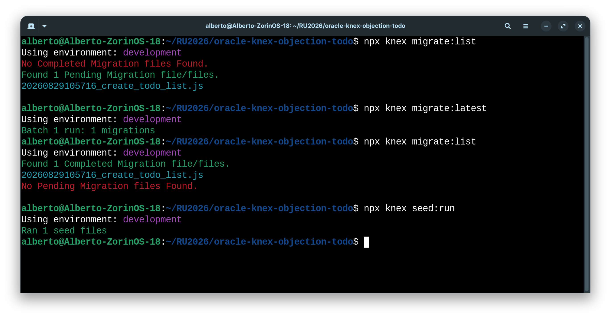

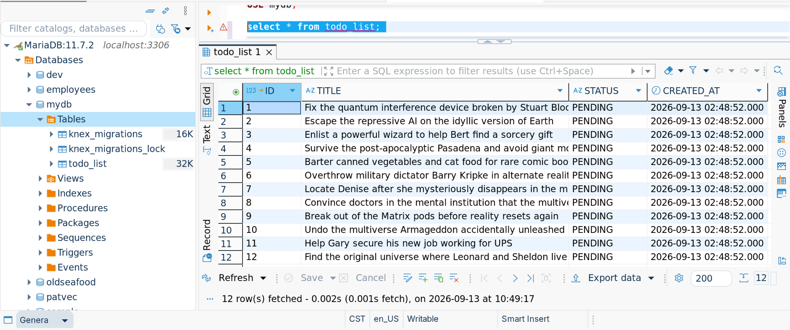


#### III. As of Connection
Database specific operation must be be modified. 

`testConn.js`
```
/**
 * testConn.js
 */
import db from './db.js';

async function testConnection() {
  try {
    // Run a simple query to confirm MariaDB connectivity
    // VERSION() returns the exact string version of your MariaDB engine
    const result = await db.raw('SELECT VERSION() AS mariadb_version');
    
    // In Knex with the mysql2 driver, data rows populate the first index array element
    const version = result[0][0].mariadb_version;
    console.log(`✅ Connection OK! MariaDB Server version: ${version}`);

  } catch (err) {
    console.error('❌ Connection failed:', err);
  } finally {
    // Always close the pool
    await db.destroy();
  }
}

testConnection();
```

And no need to change a single line on `Todo.js` model. 
```
node src/queryTodos.js 
node src/updateTodos.js

node src/todos.js
```

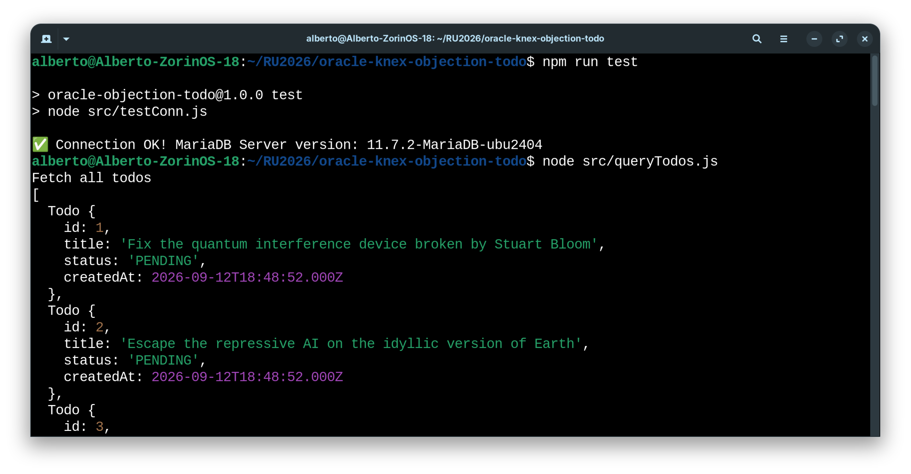

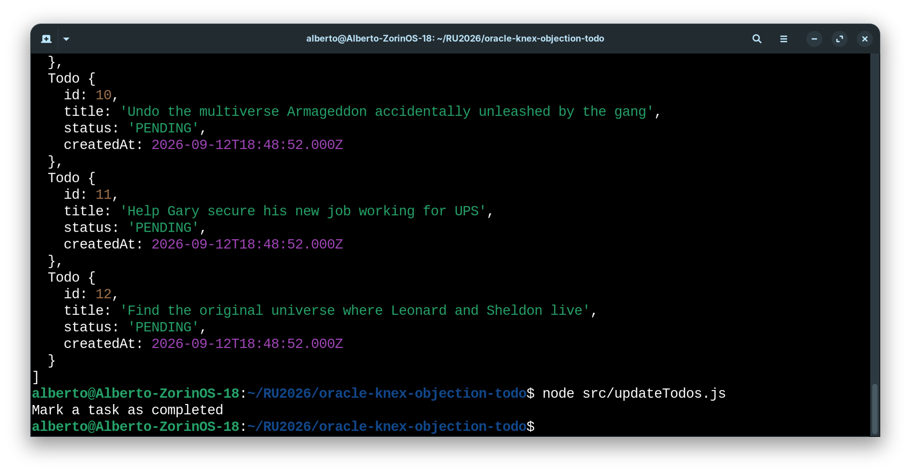


#### IV. As of Sequence
The only code we need to modified in `todos.js` is `deleteAllTodos` function which make use of MariaDB specific operation to reset the sequence:  
```
    /**
      * Reset the sequence to start at 1.
      * For todo_list created with knex migrate.
      */
    await db.raw('ALTER SEQUENCE "todo_list_seq" RESTART START WITH 1');
```

Differs from Oracle: 
```
    /**
      * Reset the sequence to start at 1.
      * Separate native SQL command to reset the auto-increment ID field back to 1
      */
    await db.raw('ALTER TABLE TODO_LIST AUTO_INCREMENT = 1;');
```

As you can see, using `knex` can not garantee 100% isolation. 

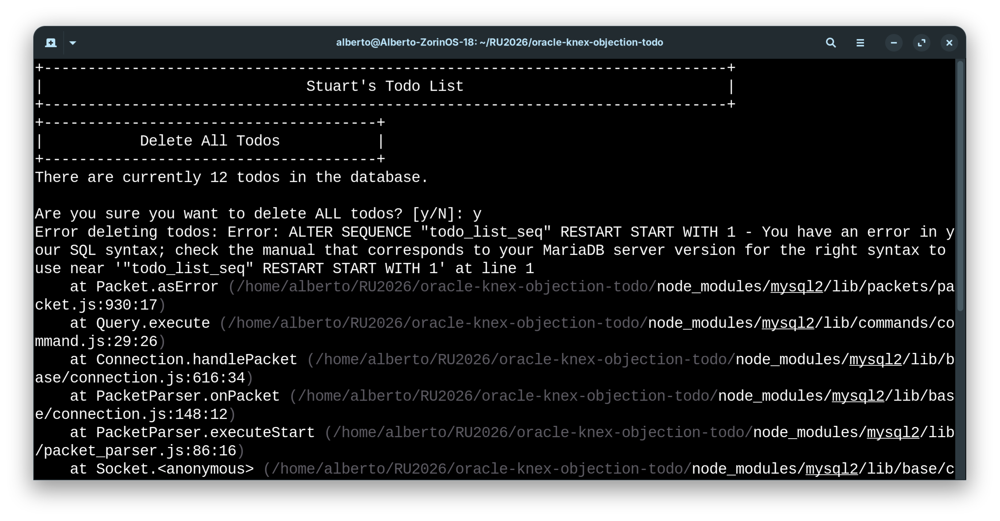

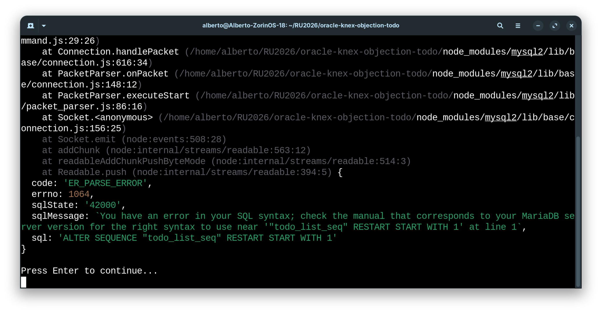


#### V. As of [SQLite](https://sqlite.org/)
> When you use the [SQLite3](https://www.npmjs.com/package/sqlite3) or [Better-SQLite3](https://www.npmjs.com/package/better-sqlite3) adapter, there is a filename required, not a network connection. 

```
npm install better-sqlite3
```

Then, use different driver like so:

`knex.js` 
```
export default {
  /**
   * Development
   */
  development: {
    client: 'better-sqlite3',
    connection: {
      filename: process.env.DB_FILENAME,
      options: {
        useNullAsDefault: true
      }
    },
    migrations: {
      directory: './migrations',
      tableName: 'knex_migrations',
      stub: './stubs/migration.stub'
    },
    seeds: {
      directory: './seeds',
      stub: './stubs/seed.stub'
    },
    debug: false,              // log SQL queries to console
    asyncStackTraces: false,   // show full async stack traces on errors
    fetchAsString: [ 'DATE', 'NUMBER' ], // return DATE/NUMBER columns as strings
  }
};
```

And run the commands like so:

```
npx knex migrate:list 
npx knex migrate:latest 
npx knex migrate:list 

npx knex seed:run
```

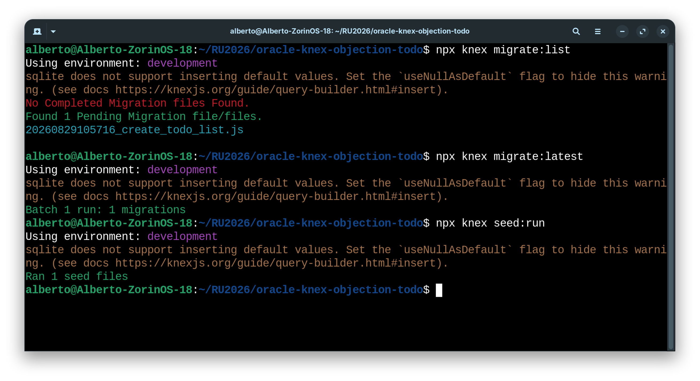

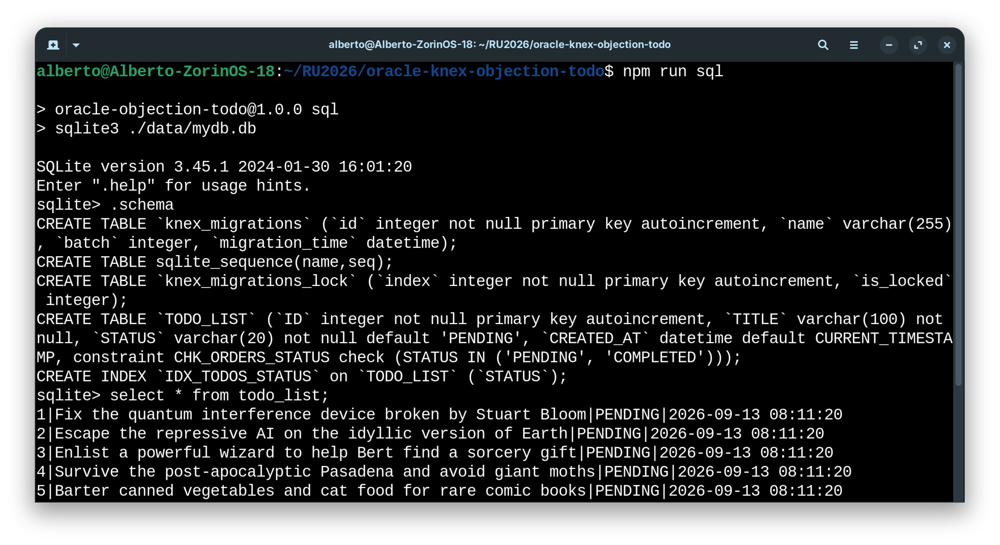

Database specific operation must be be modified.

`testConn,js` 
```
/**
 * testConn.js
 */
import db from './db.js';

async function testConnection() {
  try {
    // 1. Run a generic core runtime metadata query for SQLite
    // sqlite_version() is the standard built-in function to query engine parameters
    const result = await db.raw('SELECT sqlite_version() AS sqlite_version');
    
    // 2. Extract data payload properties safely
    // Unlike mysql2, better-sqlite3 returns a clean, flat Array of Objects immediately
    const version = result[0].sqlite_version;
    console.log(`✅ Connection OK! SQLite Server version: ${version}`);

  } catch (err) {
    console.error('❌ Connection failed:', err);
  } finally {
    // Always close the pool
    await db.destroy();
  }
}

testConnection();
```

Further changes to `Todo.js` model.

```
/**
 * Todo.js
 */
import { Model } from 'objection';

class Todo extends Model {
  static get tableName() {
    return 'TODO_LIST';
  }

  static get idColumn() {
    return 'ID';
  }

  static get columnNameMappers() {
    return {
      parse(obj) {
        return {
          id: obj.ID,
          title: obj.TITLE,
          status: obj.STATUS,
          createdAt: obj.CREATED_AT
        };
      },
      format(javascriptObj) {
        if (!javascriptObj) return javascriptObj;
        const dbPayload = {};
        
        // Map fields safely only if they are defined on your code object
        if (javascriptObj.id !== undefined) dbPayload.ID = javascriptObj.id;
        if (javascriptObj.title !== undefined) dbPayload.TITLE = javascriptObj.title;
        if (javascriptObj.status !== undefined) dbPayload.STATUS = javascriptObj.status;
        if (javascriptObj.createdAt !== undefined) dbPayload.CREATED_AT = javascriptObj.createdAt;
        
        return dbPayload;
      }
    };
  }
}

export default Todo; 
```

```
node src/queryTodos.js 
node src/updateTodos.js

node src/todos.js
```

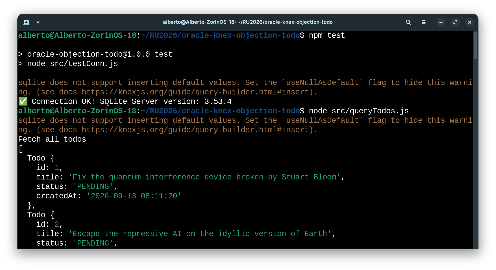

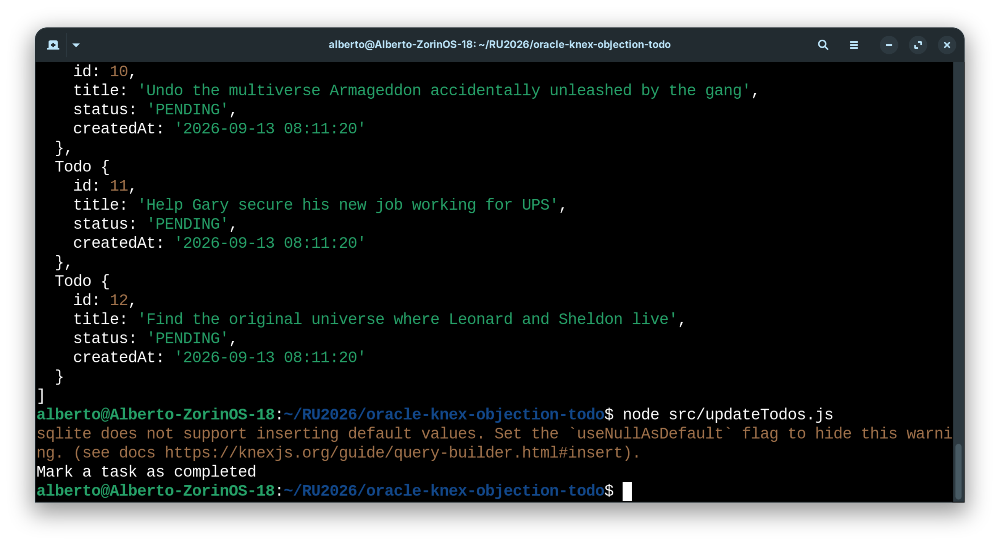

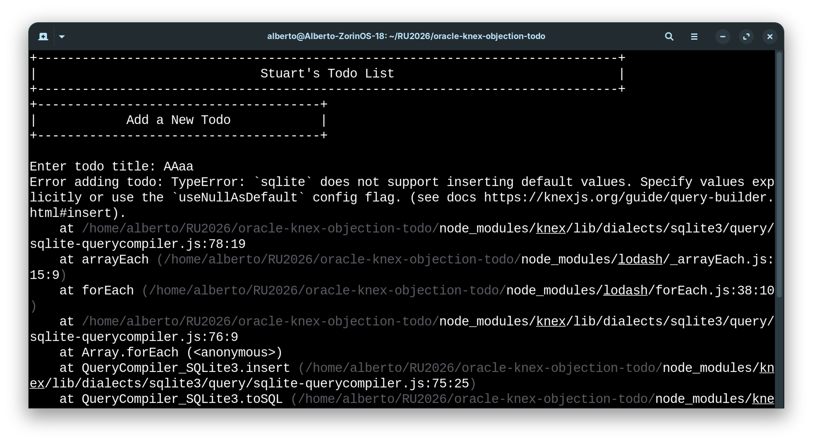

And of course, SQLite use different way to reset the sequence: 

```
    /**
      * Reset the sequence to start at 1.
      * Separate native SQL command to reset the auto-increment ID field back to 1
      */
    await db.raw("UPDATE sqlite_sequence SET seq = 0 WHERE name = 'TODO_LIST';");
```


#### VI. Summary 
In short, if you are using **Code-First** approach, you need to: 

1. Use [Knex.js](https://knexjs.org/) [Migrations CLI](https://knexjs.org/guide/migrations.html#migration-cli) to create database tables;
2. Use [Knex.js](https://knexjs.org/) [Seed CLI](https://knexjs.org/guide/migrations.html#seed-cli) to feed tables with sample data;
3. Use [Knex.js](https://knexjs.org/) [Query Builder](https://knexjs.org/guide/query-builder.html#knex) or [Raw](https://knexjs.org/guide/raw.html) access to database tables; 
4. Use [Objection.js](https://vincit.github.io/objection.js/) to add **Model** and integrated with [Knex.js](https://knexjs.org/) and access to database in way of ORM. 

If you are using **Database-First** approach and populate data by yourself, you only need step 3 and/or in the above list.  


#### Epilogue 
It is more *tedious* to work with multiple databases and even this idea is tedious to think of... 


### EOF (2026/09/25)
