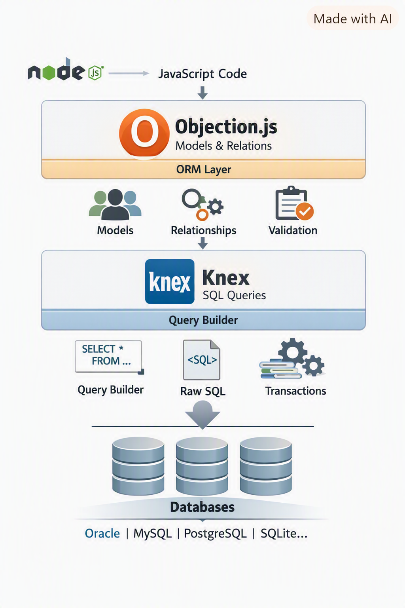
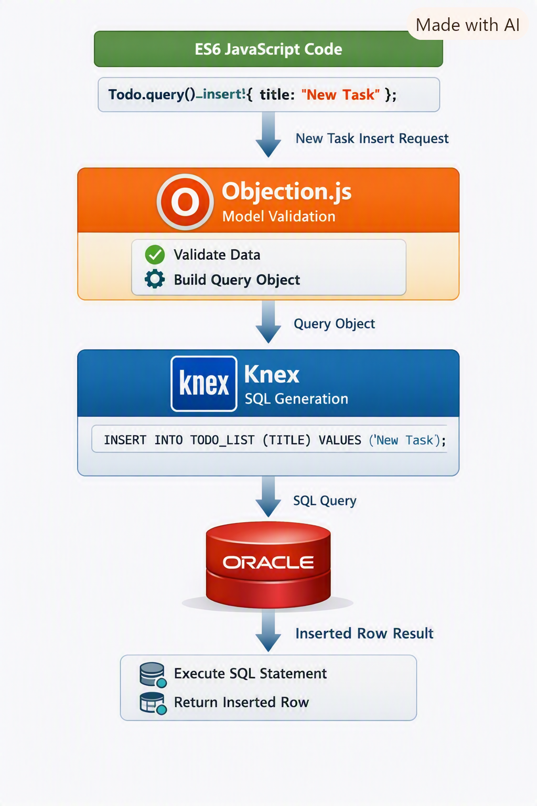

### Tutorial: Building an Oracle Todo App with Objection.js + Knex.js




#### 1. Introduction

When you build Node.js applications that interact with relational databases, you often face a choice between raw SQL and ORM frameworks. For Oracle, the ecosystem is smaller than for PostgreSQL or MySQL, but [Knex.js](https://knexjs.org/) and [Objection.js](https://vincit.github.io/objection.js/) together form a powerful, flexible, and JavaScript‑friendly stack.

This guide walks you through creating a **Todo List** app using Oracle, Knex.js, and Objection.js — all written in **ES6 import syntax**. You’ll learn how to connect to Oracle, define models, run migrations, seed data, and query your database elegantly.

We’ll use this Oracle schema:

```sql
CREATE TABLE todo_list (
    id          NUMBER GENERATED BY DEFAULT AS IDENTITY PRIMARY KEY,
    title       VARCHAR2(100) NOT NULL,
    status      VARCHAR2(20) DEFAULT 'PENDING',
    created_at  TIMESTAMP DEFAULT CURRENT_TIMESTAMP
);
```


#### 2. Project Setup

##### Step 1: Initialize the project

```bash
mkdir oracle-objection-todo
cd oracle-objection-todo
npm init -y
```

##### Step 2: Enable ES modules

In your `package.json`, add:

```json
{
  "type": "module"
}
```

This tells Node.js to use ES6 import/export syntax.

##### Step 3: Install dependencies

```bash
npm install knex objection oracledb
```


#### 3. Configure Knex.js

Create a file named `knexfile.js`:

```js
export default {
  client: 'oracledb',
  connection: {
    user: 'albertoi',
    password: 'your_password',
    connectString: 'localhost/XEPDB1'
  },
  pool: { min: 2, max: 10 }
};
```

Then create `db.js` to initialize Knex and Objection:

```js
import Knex from 'knex';
import { Model } from 'objection';
import knexConfig from './knexfile.js';

const knex = Knex(knexConfig);
Model.knex(knex);

export default knex;
```


#### 4. Define the Model

Create `models/Todo.js`:

```js
import { Model } from 'objection';

class Todo extends Model {
  static get tableName() {
    return 'TODO_LIST';
  }

  static get idColumn() {
    return 'ID';
  }

  static get jsonSchema() {
    return {
      type: 'object',
      required: ['title'],
      properties: {
        id: { type: 'integer' },
        title: { type: 'string', maxLength: 100 },
        status: { type: 'string', enum: ['PENDING', 'COMPLETED'] },
        created_at: { type: 'string' }
      }
    };
  }
}

export default Todo;
```


#### 5. Insert Sample Data

You can seed the database programmatically:

```js
import Todo from './models/Todo.js';

async function seedTodos() {
  await Todo.query().insert([
    { title: 'Fix the quantum interference device broken by Stuart Bloom' },
    { title: 'Escape the repressive AI on the idyllic version of Earth' },
    { title: 'Enlist a powerful wizard to help Bert find a sorcery gift' },
    { title: 'Survive the post-apocalyptic Pasadena and avoid giant moths' },
    { title: 'Barter canned vegetables and cat food for rare comic books' },
    { title: 'Overthrow military dictator Barry Kripke in alternate reality' },
    { title: 'Locate Denise after she mysteriously disappears in the multiverse' },
    { title: 'Convince doctors in the mental institution that the multiverse is real' },
    { title: 'Break out of the Matrix pods before reality resets again' },
    { title: 'Undo the multiverse Armageddon accidentally unleashed by the gang' },
    { title: 'Help Gary secure his new job working for UPS' },
    { title: 'Find the original universe where Leonard and Sheldon live' }
  ]);
}

seedTodos();
```


#### 6. Query Examples

##### Fetch all todos
```js
import Todo from './models/Todo.js';

const todos = await Todo.query();
console.log(todos);
```

##### Fetch pending tasks
```js
const pending = await Todo.query().where('STATUS', 'PENDING');
console.log(pending);
```

##### Mark a task as completed
```js
await Todo.query().findById(1).patch({ status: 'COMPLETED' });
```

##### Count tasks by status
```js
const counts = await Todo.query()
  .select('STATUS')
  .count('* as count')
  .groupBy('STATUS');

console.log(counts);
```


#### 7. Migrations with Knex

Knex provides a CLI for schema management.

Create a migration:
```bash
npx knex migrate:make create_todo_list
```

Edit the migration file:
```js
export async function up(knex) {
  await knex.schema.createTable('TODO_LIST', table => {
    table.increments('ID').primary();
    table.string('TITLE', 100).notNullable();
    table.string('STATUS', 20).defaultTo('PENDING');
    table.timestamp('CREATED_AT').defaultTo(knex.fn.now());
  });
}

export async function down(knex) {
  await knex.schema.dropTable('TODO_LIST');
}
```

Run it:
```bash
npx knex migrate:latest
```


#### 8. Seeding Data with Knex

Create a seed file:
```bash
npx knex seed:make seed_todos
```

Edit it:
```js
export async function seed(knex) {
  await knex('TODO_LIST').del();
  await knex('TODO_LIST').insert([
    { TITLE: 'Fix the quantum interference device broken by Stuart Bloom' },
    { TITLE: 'Escape the repressive AI on the idyllic version of Earth' },
    { TITLE: 'Enlist a powerful wizard to help Bert find a sorcery gift' },
    { TITLE: 'Survive the post-apocalyptic Pasadena and avoid giant moths' },
    { TITLE: 'Barter canned vegetables and cat food for rare comic books' },
    { TITLE: 'Overthrow military dictator Barry Kripke in alternate reality' },
    { TITLE: 'Locate Denise after she mysteriously disappears in the multiverse' },
    { TITLE: 'Convince doctors in the mental institution that the multiverse is real' },
    { TITLE: 'Break out of the Matrix pods before reality resets again' },
    { TITLE: 'Undo the multiverse Armageddon accidentally unleashed by the gang' },
    { TITLE: 'Help Gary secure his new job working for UPS' },
    { TITLE: 'Find the original universe where Leonard and Sheldon live' }
  ]);
}
```

Run seeds:
```bash
npx knex seed:run
```


#### 9. Advanced Queries

##### Search by keyword
```js
const results = await Todo.query().where('TITLE', 'like', '%multiverse%');
console.log(results);
```

##### Pagination
```js
const page = await Todo.query().page(0, 5);
console.log(page.results);
```

##### Raw SQL fallback
```js
const raw = await Todo.knex().raw(
  'SELECT * FROM TODO_LIST WHERE STATUS = :status',
  { status: 'PENDING' }
);
console.log(raw);
```


#### 10. Project Structure

```
oracle-objection-todo/
├── knexfile.js
├── db.js
├── models/
│   └── Todo.js
├── migrations/
├── seeds/
├── services/
│   └── todoService.js
└── index.js
```

- **models/** → Objection models  
- **services/** → Business logic  
- **migrations/** → Schema changes  
- **seeds/** → Sample data  


#### 11. Service Layer

`services/todoService.js`:
```js
import Todo from '../models/Todo.js';

export async function getPendingTodos() {
  return await Todo.query().where('STATUS', 'PENDING');
}

export async function completeTodo(id) {
  return await Todo.query().findById(id).patch({ status: 'COMPLETED' });
}

export async function addTodo(title) {
  return await Todo.query().insert({ title });
}
```


#### 12. Example Application

`index.js`:
```js
import { getPendingTodos, completeTodo, addTodo } from './services/todoService.js';

async function main() {
  await addTodo('Defeat the evil AI overlord in Macau');
  const pending = await getPendingTodos();
  console.log('Pending tasks:', pending);

  if (pending.length > 0) {
    await completeTodo(pending[0].ID);
    console.log('Marked first task as completed.');
  }
}

main();
```


#### 13. Understanding the Architecture

At a high level, the architecture looks like this:

- **Application Code (Node.js)**  
  You write JavaScript using Objection.js models (`Todo`, `User`, etc.).

- **Objection.js (ORM Layer)**  
  Provides models, relations, validation, and convenience methods. It translates your model queries into Knex queries.

- **Knex.js (Query Builder)**  
  Generates SQL statements appropriate for Oracle (or other databases). It manages migrations, transactions, and raw SQL execution.

- **Database Driver (`node-oracledb`)**  
  Executes the SQL against Oracle and returns results.

- **Oracle Database**  
  Stores your tables, rows, and business data.

This layered approach means you can start with ORM‑style queries (`Todo.query().insert(...)`) but still drop down to Knex or raw SQL when you need maximum control.


#### 14. Example Workflow

Let’s trace a simple workflow: adding a new todo.

1. **Application Code**
   ```js
   import Todo from './models/Todo.js';
   await Todo.query().insert({ title: 'Defeat the evil AI overlord in Macau' });
   ```

2. **Objection.js**
   - Validates the input against the model schema.
   - Builds a Knex query object.

3. **Knex.js**
   - Converts the query object into SQL:
     ```sql
     INSERT INTO TODO_LIST (TITLE, STATUS, CREATED_AT)
     VALUES ('Defeat the evil AI overlord in Macau', 'PENDING', CURRENT_TIMESTAMP)
     ```
   - Passes it to the Oracle driver.

4. **Oracle Driver**
   - Executes the SQL against the database.
   - Returns the inserted row’s ID.

5. **Application Code**
   - Receives the result and continues execution.


#### 15. Transactions

Knex supports transactions, and Objection integrates seamlessly.

```js
import knex from './db.js';
import Todo from './models/Todo.js';

async function transactionalExample() {
  await knex.transaction(async trx => {
    await Todo.query(trx).insert({ title: 'Start transaction demo' });
    await Todo.query(trx).insert({ title: 'Second insert in same transaction' });
    // If an error occurs, both inserts are rolled back.
  });
}
```


#### 16. Relations (Future Expansion)

Even though our `todo_list` table is standalone, Objection shines when you have multiple tables with relations. For example, if you had a `users` table:

```js
import { Model } from 'objection';
import Todo from './Todo.js';

class User extends Model {
  static get tableName() {
    return 'USERS';
  }

  static get relationMappings() {
    return {
      todos: {
        relation: Model.HasManyRelation,
        modelClass: Todo,
        join: {
          from: 'USERS.ID',
          to: 'TODO_LIST.USER_ID'
        }
      }
    };
  }
}

export default User;
```

Then you could query with relations:

```js
const usersWithTodos = await User.query().withGraphFetched('todos');
```


#### 17. Validation

Objection’s `jsonSchema` ensures data integrity at the application level:

```js
static get jsonSchema() {
  return {
    type: 'object',
    required: ['title'],
    properties: {
      title: { type: 'string', maxLength: 100 },
      status: { type: 'string', enum: ['PENDING', 'COMPLETED'] }
    }
  };
}
```

If you try to insert a todo with a missing title or invalid status, Objection will throw an error before hitting the database.


#### 18. Best Practices

- **Keep models lean**: Only define schema and relations in models. Put business logic in services.  
- **Use migrations**: Always manage schema changes with Knex migrations for consistency.  
- **Seed data**: Use Knex seeds for test/demo data.  
- **Transactions**: Wrap multi‑step operations in transactions.  
- **Error handling**: Catch and log database errors gracefully.  
- **Raw SQL fallback**: Don’t hesitate to use raw queries for complex Oracle features.  


#### 19. Pros & Cons Recap

**Pros of Objection.js + Knex.js**  
- Works in pure JavaScript (ES6 imports supported).  
- Oracle support via `node-oracledb`.  
- Flexible: ORM features + raw SQL.  
- Lightweight, not bloated.  

**Cons**  
- Migrations are manual (Knex CLI).  
- Less polished tooling compared to Prisma.  
- Minimal type safety in JS (better in TS).  


#### 20. Conclusion

By combining **Objection.js** and **Knex.js**, you get the best of both worlds: ORM convenience and SQL flexibility. For Oracle projects in JavaScript, this stack is practical, stable, and developer‑friendly.

Your `todo_list` table becomes a playground for experimenting with inserts, queries, updates, and transactions. As your project grows, you can add relations, validation, and service layers — all while staying in modern ES6 syntax.




#### Appendix: Objection.js + Knex.js vs Prisma

| Feature | **Objection.js + Knex.js** | **Prisma** |
|---------|-----------------------------|------------|
| **Oracle Support** | ✅ Works via Knex + `node-oracledb` driver | ❌ Not supported |
| **Language Orientation** | ✅ Pure JavaScript (no TypeScript required) | ⚠️ TypeScript‑first (JS possible but limited) |
| **Philosophy** | Query builder + lightweight ORM | Schema‑first, declarative ORM |
| **Schema Definition** | Models as JS classes | `.prisma` schema file |
| **Type Safety** | Minimal in JS (no TS types) | Excellent in TS, weaker in JS |
| **Migrations** | Knex migration system (manual, flexible) | Prisma Migrate (integrated, declarative) |
| **Querying Style** | SQL‑like via Knex, flexible | Abstracted, fluent API |
| **Performance** | Very good, close to raw SQL | Excellent, optimized client |
| **Community & Ecosystem** | Strong in JS/Knex world | Rapidly growing, TS‑heavy |
| **Learning Curve** | Moderate (SQL familiarity helps) | Lower for TS devs, higher for JS‑only |
| **Best Use Case** | JS‑only projects needing Oracle support | Modern TS projects with PostgreSQL/MySQL/etc. |


📌 **Practical Takeaways**
- If you’re building with **Oracle + JavaScript only**, Objection.js + Knex.js is the right choice.  
- If you’re using **PostgreSQL/MySQL/etc. and TypeScript**, Prisma offers superior developer experience and tooling.  
- Objection.js gives you flexibility and SQL‑like control, while Prisma emphasizes type safety and productivity.  


### EOF (2026/08/28)
